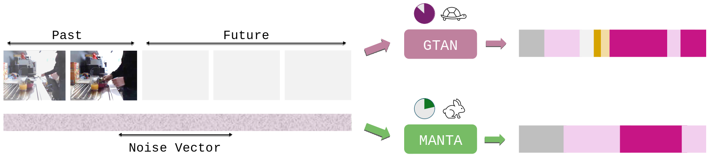
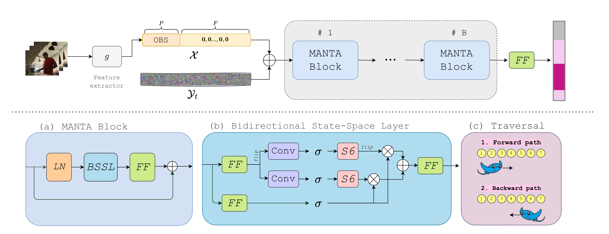

# [CVPR 2025] MANTA: Diffusion Mamba for Efficient and Effective Stochastic Long-Term Dense Anticipation

We propose a novel MANTA (MAmba for ANTicipation) network for stochastic long-term dense anticipation. Our model enables effective long-term temporal modelling even for very long sequences while maintaining linear complexity in sequence length.

Here is the overview of our proposed model:
<p align="center">

</p>
<p align="center">

</p>


## Citation
If you find this code or our model useful, please cite our [paper](https://arxiv.org/abs/2501.08837):
```latex
@inproceedings{zatsarynna2025manta,
    author    = {Olga Zatsarynna and Emad Bahrami and Yazan Abu Farha and Gianpiero Francesca and Juergen Gall},
    title     = {MANTA: Diffusion Mamba for Efficient and Effective Stochastic Long-Term Dense Action Anticipation},
    booktitle={IEEE Conference on Computer Vision and Pattern Recognition (CVPR)},
    year={2025},
}
```

## Installation
To create the [conda](https://docs.conda.io/en/latest/) environment run the following command:
```bash
# install conda
conda env create --name manta --file docker/env.yml
source activate manta

# install mamba
cd docker/VideoMamba

# causal conv
cd causal-conv1d
python setup.py develop
cd ..

# mamba
cd mamba
python setup.py develop
cd ..
```

## Datasets

### Breakfast
The features and annotations of the Breakfast dataset can be downloaded from 
[link 1](https://mega.nz/#!O6wXlSTS!wcEoDT4Ctq5HRq_hV-aWeVF1_JB3cacQBQqOLjCIbc8) 
or 
[link 2](https://zenodo.org/record/3625992#.Xiv9jGhKhPY).


### Assembly101
Follow the instructions at [Assembly101-Download-Scripts](https://github.com/assembly-101/assembly101-download-scripts) to download the TSM features.
We converted the `.lmdb` features to `numpy` for faster loading.
The  `coarse-annotations` can be downloaded from [assembly101-annotations](https://drive.google.com/drive/folders/1QoT-hIiKUrSHMxYBKHvWpW9Z9aCznJB7). 


### 1. Training and Evaluation
To train the MANTA, run:
```bash
bash scripts/prob/train_<dataset>_prob.sh
```

To evaluate the MANTA, run:
```bash
bash scripts/prob/predict_<dataset>_prob.sh
```

This will show the evaluation results of the final model, as well as save final predictions
into the ```./diff_results``` directory. 
With the final results saved, you can run the evaluation faster using the following script:
```bash
bash scripts/prob/predict_precomputed_<dataset>_prob.sh
```

Make sure to update the paths (features and annotations) in the above scripts to match your system.
For changing the training and evaluation splits (for Breakfast dataset), 
as well as values of other hyper-parameters, modify the scripts accordingly.


## Acknowledgement
In our code we made use of the following repositories: [VideoMamba](https://github.com/OpenGVLab/VideoMamba), [VideoMambaSuite](https://github.com/OpenGVLab/video-mamba-suite) and [LTC](https://github.com/LTContext/LTContext). We sincerely thank the authors for their codebases!

## License
<a rel="license" href="http://creativecommons.org/licenses/by-nc/4.0/"></a><br />This work is licensed under a <a rel="license" href="http://creativecommons.org/licenses/by-nc/4.0/">Creative Commons Attribution-NonCommercial 4.0 International License</a>.


